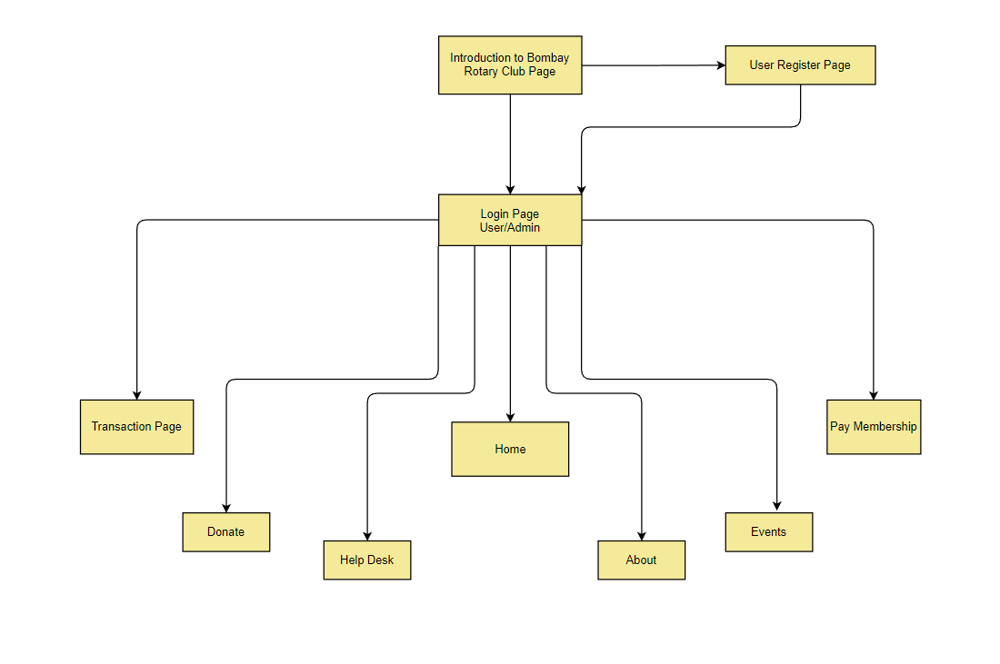

# Rotary Club of Bombay

## Introduction

React Native Application for Rotary Club of Bombay Educational project!

## Overview of the App

## Tech Stack
- 
- )
- )

## License

Distributed under the MIT License. See `LICENSE` for more information.
